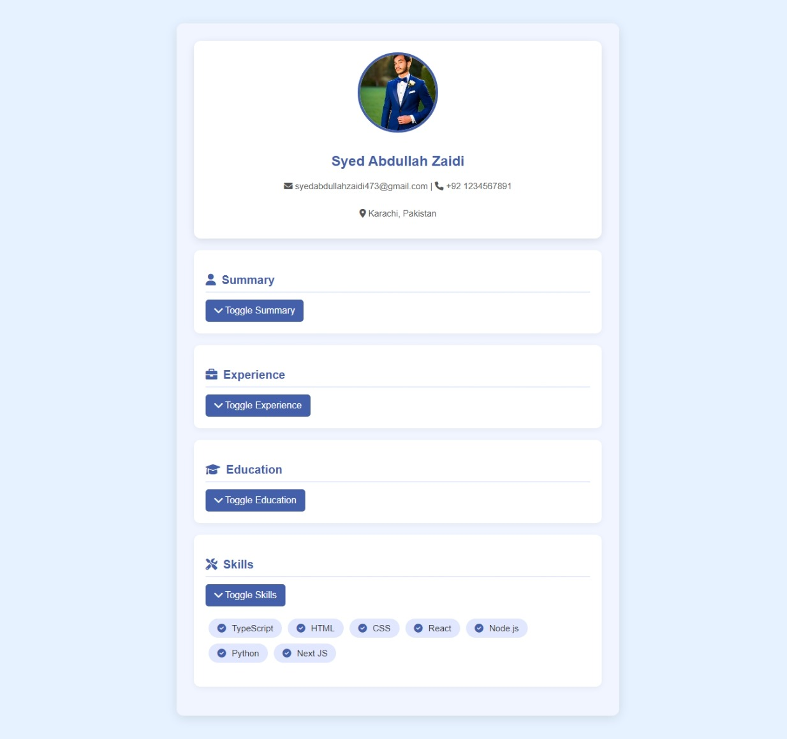

```markdown
# Modern Resume

A modern resume web application that showcases personal information, skills, experience, and education in a visually appealing manner. This project utilizes HTML, CSS, and TypeScript to create an interactive user experience.

## Features

- Responsive design optimized for mobile and desktop views.
- Toggle functionality for sections such as Summary, Experience, Education, and Skills.
- Use of Font Awesome icons for improved aesthetics.
- Dynamic display of personal information and skills.

## Technologies Used

- HTML
- CSS
- TypeScript
- Font Awesome (for icons)

## Getting Started

Follow these instructions to set up the project locally.

### Prerequisites

- A modern web browser (Chrome, Firefox, Safari, etc.)
- Node.js and npm (for TypeScript compilation)

### Installation

1. **Clone the repository:**

   ```bash
   git clone https://github.com/your-username/modern-resume.git
   cd modern-resume
   ```

2. **Install TypeScript globally (if not installed):**

   ```bash
   npm install -g typescript
   ```

3. **Compile TypeScript files:**

   ```bash
   tsc script.ts
   ```

4. **Open the `index.html` file in your web browser.**

## Usage

- Click on the "Toggle" buttons to expand or collapse sections for Summary, Experience, Education, and Skills.
- The resume displays personal details along with a list of skills that can be customized in the HTML.

## Example

 <!-- Replace this with an actual screenshot of your project -->

## Contributing

Contributions are welcome! If you'd like to contribute to this project, please fork the repository and submit a pull request.

## License

This project is licensed under the MIT License - see the [LICENSE](LICENSE) file for details.

## Acknowledgements

- Special thanks to [Font Awesome](https://fontawesome.com) for the icons used in the project.
- Inspired by modern web design trends.

## Contact

For any inquiries, please reach out to:

- Email: syedabdullahzaidi473@gmail.com
- LinkedIn: [MY LinkedIn Profile](https://www.linkedin.com/in/syed-abdullah-zaidi-a281552b5/)
